## An algorithm for the generalized eigenvalue problem for nonsquare matrix pencils by minimal perturbation approach  2016

### 摘要：

### 1进展

### 2复现结果

####        2.1  复现结果1

#####         A 条件数

​         原文给出了A,B的条件数，分别为$Condition_A = 20.0,Condition_B= 4.98$,给出了广义特征多项式的特征值的解，但未给出原始矩阵，因此无法完全复现文章计算；只能保障矩阵A，B的条件数和原文保持一致。

#####         B噪声水平

​         抛开文章中的条件数不谈，仅控制噪声水平来做独立重复实验，每个噪声水平设置100次独立重复实验。噪声符合0均值，标准差为$\delta = [0,0.25,0.5,0.75,1,1.25,1.5]$的高斯分布。

| 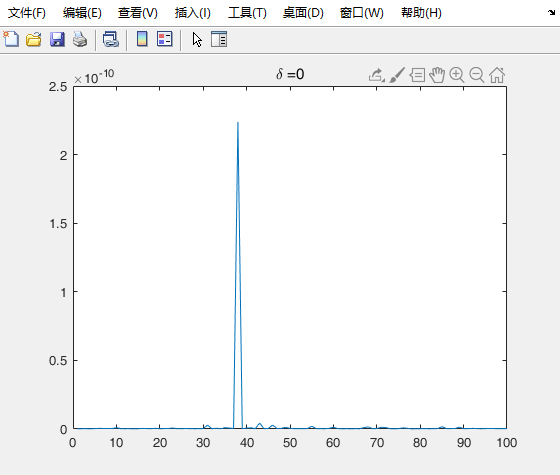  | 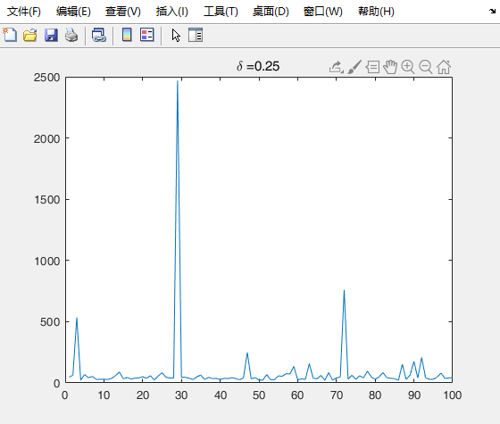 |
| ---------------------- | ---------------------- |
| 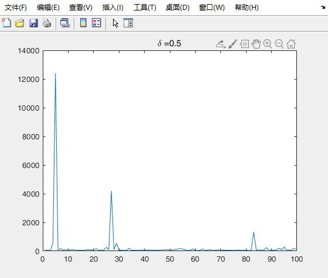 | 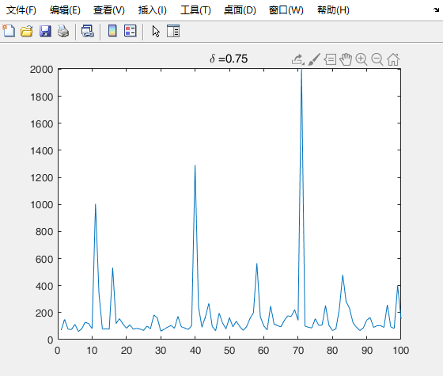 |
| 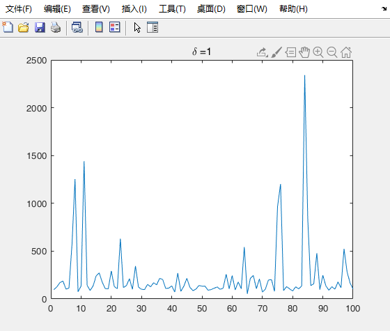 | 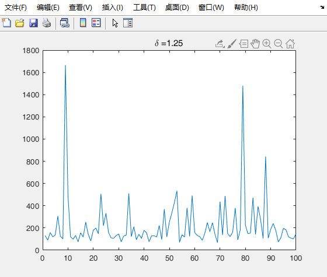 |
| 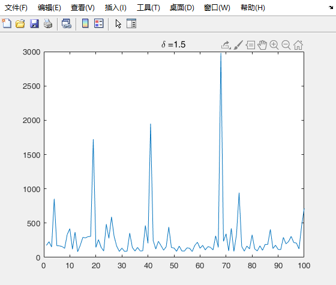 |                        |
|                        |                        |
|                        |                        |

####        2.2  复现结果2

 **表1 原始数据准备**

| 原始构建矩阵P         | 原始构建矩阵Q                                    |
| --------------------- | ------------------------------------------------ |
| 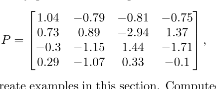 | 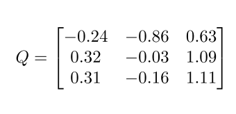                            |
| 生成数据A1 B1         | 生成数据A2 B2                                    |
| 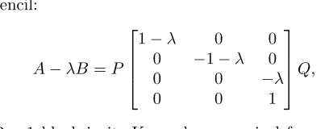 | 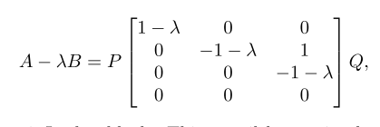 |

**表2 第一组数据对比**

| 复现                  | 原文                      |
| --------------------- | ------------------------- |
| 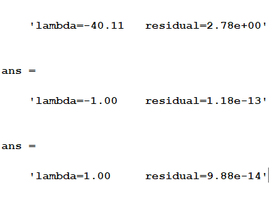 | **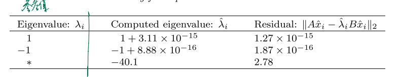** |

 **表3 第二组数据对比**

| 复现                  | 原文                  |
| --------------------- | --------------------- |
| 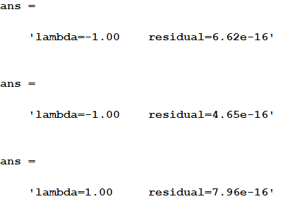 | 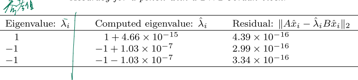 |

### 3  发现问题

​      A.  特征值共轭出现

​           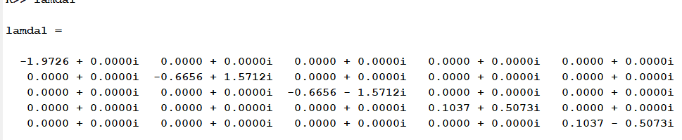

​          